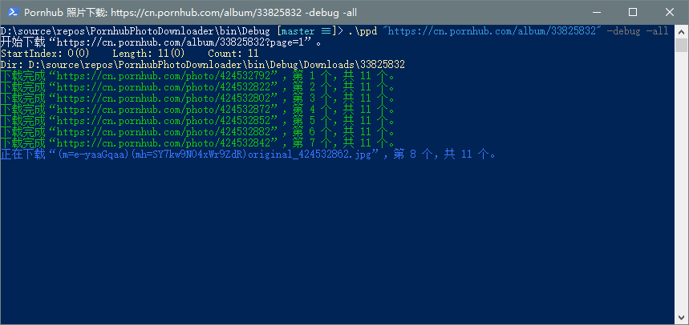

# Pornhub Photo Downloader

<p>
    <a href="https://github.com/nicengi/PornhubPhotoDownloader/releases"></a>
    <a href="https://github.com/nicengi/PornhubPhotoDownloader/blob/master/LICENSE"></a>
</p>

批量下载 Pornhub 上的相册或照片。

```powershell
示例 .\ppd "https://cn.pornhub.com/album/48071401" -all
```

#### 重命名

​	使用[关键字](@参数)以重命名下载目录和文件名。	

```powershell
示例 .\ppd "https://cn.pornhub.com/album/48071401" -all -dir:"Downloads\{album}"
```

## 参数

| 名称              | 描述                             | 附加                                                       |
| ----------------- | -------------------------------- | ---------------------------------------------------------- |
| {url}             | 相册或照片链接。                 | 必须在参数列表的首位。                                     |
| -All              | 下载相册的所有照片。             | 仅相册。                                                   |
| -Dir:{path}       | 指定下载目录。                   | 关键字“{id}”、“{album}”、“{page}”。                        |
| -Index:{value}    | 指定起始的下载位置（从零开始）。 | 指定“-All”时选项将被忽略。                                 |
| -Length:{value}   | 指定将下载的照片数量。           | 指定“-All”时选项将被忽略。                                 |
| -Debug            | 显示调试信息。                   |                                                            |
| -Info             | 显示更多的调试信息。             | 这是“-Debug”的附加选项。                                   |
| -Lang:{value}     | 指定区域。                       | -Lang:en                                                   |
| -Rename:{pattern} | 使用指定的格式重命名文件。       | 关键字“{index}”、“{id}”、“{albumid}”、“{album}”、“{ext}”。 |

## 截图

